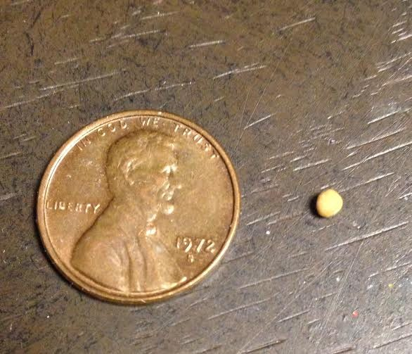

# The Parable of the Mustard Seed
Q: What do you guys think of mustard? Good condiment or not?
### Example of Mustard Seeds

Mustard seeds are usually a stand in to represent something small and insignificant

Example of mustard seeds referencing to small beginning
- **Matthew 17:20**

## The Parable
[Link to all 3 passages](https://www.biblegateway.com/passage/?search=Matthew%2013%3A31-32%2CMark%204%3A30-32%2CLuke%2013%3A18-19&version=NABRE)
- **Matthew 13:31-32**
- **Mark 4:30-32** (Context: this is part of Jesus' teaching along the sea, and proceeds "The Calming of a Storm at Sea.")
- **Luke 13:18-19**

Q: What would recieving this message from Christ have meant? 
Q: What does our modern context change about how we understand this parable?

Quote from Dorothy Day: “Most of our life is unimportant, filled with trivial things from morning till night. But when it is transformed by love it is of interest even to the angels.”

## The Kingdom of Heaven
Q: What is the kingdom of heaven?
**Luke 10:9** - "The Kingdom of God has come near you"

**Matthew 5:10** - "Blessed are those who are persecuted because of righteousness,
for theirs is the kingdom of heaven."

Matthew uses the term “Kingdom of Heaven”
Mark and Luke, on the other hand, use the term “Kingdom of God” in their writings when referring to the same idea.

Ways to think about the kingdom of god:
- It is approached through understanding
- To enter, one must accept it like a little child.
- Entrance into this Kingdom is a spiritual rebirth.
- This kingdom is populated by souls who devote themselves to doing the will of God.
- "Citizens" of this kingdom are, therefore, called to live the way that Christ lived and think the way that Christ thought.

## The Plant and it's Branches
Q: How about the growing of the plant and it's branches?
**Ezek - 31:6**
**Ezek - 17:23**

The history of the church has shown Jesus’ Parable of the Mustard Seed to be true. The church has become (partially) what is referenced here (we are still on the journey).

There is a comfort that this smallest of seeds being tended to by a loving gardener.
Macro - The church is growing from a single seed, into a universal church, uniting the heart of God with the heart of man
Micro - building off of the light under the basket parable, we are to help showcase the beauty of the grown mustard tree. We are not the gardener, but we are invited to the garden.
